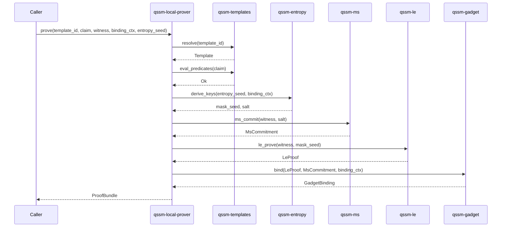
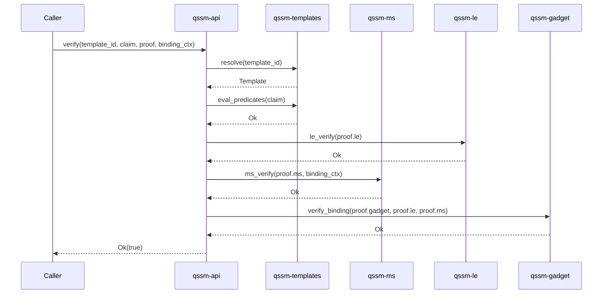
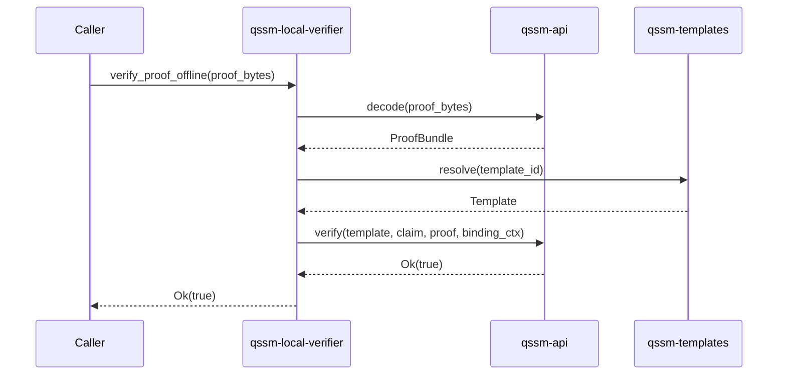

# Prove & Verify Pipeline

## Prove Flow

## Verify Flow

## Offline Verify Flow (qssm-local-verifier)

## Key Properties

| Property | Guarantee |
|---|---|
| **Determinism** | Same inputs → same `ProofBundle` bytes |
| **No internal randomness** | All entropy from caller-provided `entropy_seed` |
| **Domain separation** | Every hash call uses a unique domain tag |
| **Binding** | Proofs bound to `binding_ctx` — no cross-context replay |
| **Constant-time** | Secret operations via `subtle` crate |
| **Zeroization** | All intermediates zeroized on drop |
