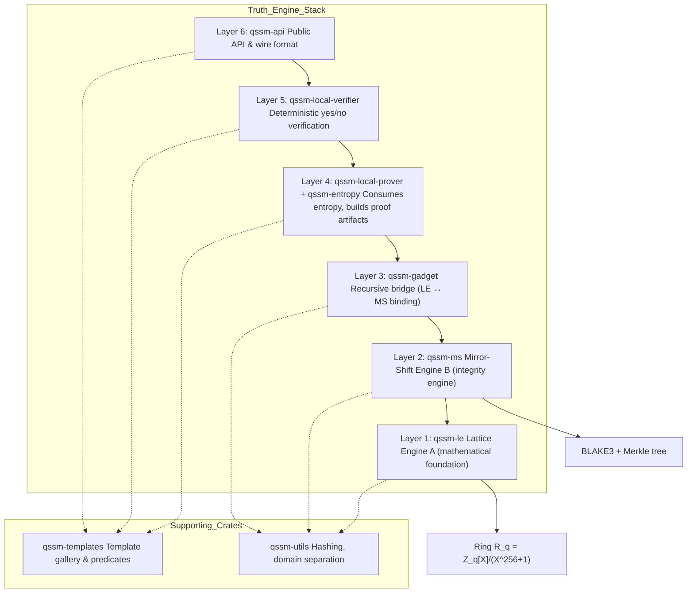

# Truth Engine — Six-Layer Stack



## Layer Responsibilities

| Layer | Crate | Role |
|-------|-------|------|
| 1 | `qssm-le` | Lattice-Engine A, the mathematical foundation of the stack; currently frozen and complete |
| 2 | `qssm-ms` | Mirror-Shift Engine B, the integrity engine and truth binder |
| 3 | `qssm-gadget` | The recursive bridge that allows Engine A to verify Engine B; currently frozen and complete |
| 4 | `qssm-local-prover` + `qssm-entropy` | Consumes entropy and produces a complete proof artifact |
| 5 | `qssm-local-verifier` | The local verifier that returns the final yes or no decision |
| 6 | `qssm-api` | The public API and wire format: how the world talks to the machine |
```