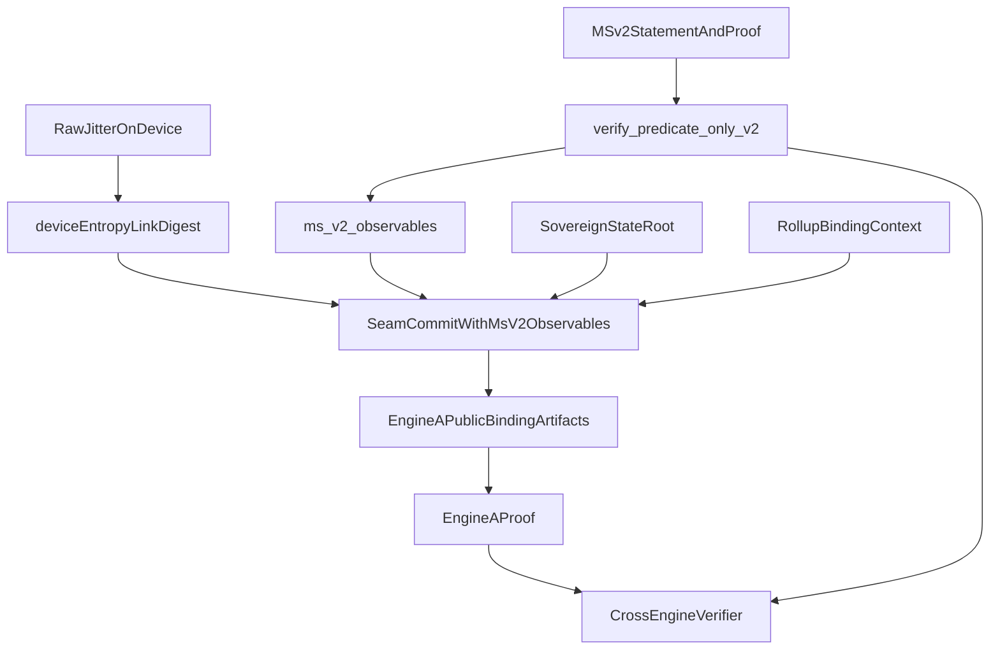

# Engine-B to Engine-A Binding Seam (Commit-Then-Open)

Status: Normative protocol contract for closing the `EngineABindingOp` gap.

## 1. Scope and threat model

This specification defines the cryptographic seam between:

- Engine B (`qssm-ms`): MS v2 predicate-only proof (`PredicateOnlyProofV2`) over a public statement (`PredicateOnlyStatementV2`).
- Engine A (`qssm-le`): sovereign public-binding commitment and Lyubashevsky-style proof surface.

Goal: a prover cannot present a valid cross-engine package unless MS v2 verification has succeeded and the same **verifier-visible** MS observables are bound into Engine A public commitments under the agreed rollup context and entropy link.

Adversary model includes:

- Cross-engine replay (MS v2 observables copied into a different Engine A context).
- Substitution (valid MS proof in isolation but not tied to A state commitment).
- Malleability on transcript inputs (domain collisions, context swaps, blind reuse across contexts).

## 2. Normative seam invariants

A valid cross-engine proof package MUST satisfy all of the following:

1. **MS v2 verification:** `verify_predicate_only_v2(statement, proof)` succeeds before any gadget seam output is accepted.
2. **Binding correctness:** seam commitment includes the **public** MS v2 observables (`ms_v2_*` family) agreed with the LE handoff.
3. **Transcript coherence:** both engines bind the same rollup / binding context digest where required by code.
4. **Entropy coherence:** MS FS binding entropy and Engine A truth-limb external entropy follow the gadget handshake (`TruthLimbV2Params` / `device_entropy_link` policy).
5. **Public minimality:** seam material uses only **verifier-visible** fields from the v2 proof and statement (no hidden witness lanes in the seam hash).

## 3. Commit-then-open seam flow

Normative sequence (gadget-aligned):

1. Prover obtains on-device raw entropy and computes `device_entropy_link` (or uses the agreed fallback policy).
2. Prover produces MS v2 proof and verifies it locally; collects `ms_v2_statement_digest`, `ms_v2_result_bit`, `ms_v2_bitness_global_challenges_digest`, `ms_v2_comparison_global_challenge`, `ms_v2_transcript_digest`.
3. Prover computes seam commitment:  
   `C_seam = H(QSSM-SEAM-MS-V2-COMMIT-v1 || state_root || ms_v2_statement_digest || ms_v2_result_bit || ms_v2_bitness_global_challenges_digest || ms_v2_comparison_global_challenge || ms_v2_transcript_digest || device_entropy_link || binding_context || truth_digest || entropy_anchor)`.
4. Prover emits Engine A-facing public artifact set containing `C_seam` and required digest lanes.
5. Verifier checks:
   - MS v2 verify success (at bridge boundary).
   - Engine A verify success.
   - Seam commitment recomputes exactly from agreed public inputs.

## 4. Domain separation (required)

Implementations MUST use unique domain tags for seam material. **Current gadget strings (exact):**

- `QSSM-SEAM-MS-V2-COMMIT-v1`
- `QSSM-SEAM-MS-V2-OPEN-v1`
- `QSSM-SEAM-MS-V2-BINDING-v1`

Historical tags `QSSM-SEAM-COMMIT-v1` / `OPEN` / `BINDING` referred to the **removed** cleartext GhostMirror seam field layout and MUST NOT be reused for the v2 seam without a version bump and migration plan.

## 5. Required input/output contract (protocol-level)

Seam input set (public fields carried by `EngineABindingInput`):

- `state_root`
- `ms_v2_statement_digest`
- `ms_v2_result_bit` (0 or 1)
- `ms_v2_bitness_global_challenges_digest`
- `ms_v2_comparison_global_challenge`
- `ms_v2_transcript_digest`
- `binding_context` (rollup / isolation digest)
- `device_entropy_link`
- `truth_digest`, `entropy_anchor`
- `claimed_seam_commitment`, `require_ms_verified` (must be true after MS verify)

Seam output set (public):

- `seam_commitment_digest` (32 bytes)
- `seam_open_digest`, `seam_binding_digest`
- Engine A public binding artifacts as defined by the handshake

## 6. Failure conditions (hard reject)

Reject the package if any of these hold:

- MS v2 verification fails.
- Engine A verification fails.
- Binding context mismatch between engines where required.
- Seam commitment digest mismatch.
- Domain tag / version mismatch.

## 7. Mapping to current code surfaces

Normative implementation:

- [`truth-engine/qssm-gadget/src/circuit/operators/ms_predicate_v2_bridge.rs`](../../../truth-engine/qssm-gadget/src/circuit/operators/ms_predicate_v2_bridge.rs) — `MsPredicateOnlyV2BridgeOp` (`verify_predicate_only_v2`).
- [`truth-engine/qssm-gadget/src/circuit/operators/engine_a_binding.rs`](../../../truth-engine/qssm-gadget/src/circuit/operators/engine_a_binding.rs) — `EngineABindingOp` commit-then-open over `ms_v2_*` fields.
- [`truth-engine/qssm-gadget/src/circuit/handshake.rs`](../../../truth-engine/qssm-gadget/src/circuit/handshake.rs) — transcript map version, `EngineAPublicJson`.

**Note:** Packaged offline verification and gadget seam binding are both on MS v2 predicate-only proof objects in the current workspace.

## 8. Privacy boundary

- Raw jitter is device-local only.
- `device_entropy_link` digest is used as blind input; never expose raw entropy bytes.
- Public artifacts are commitment digests and transcript-bound metadata only.
- If the link digest leaks broadly, privacy margins degrade; implementations SHOULD scope link lifetime per proving session.
