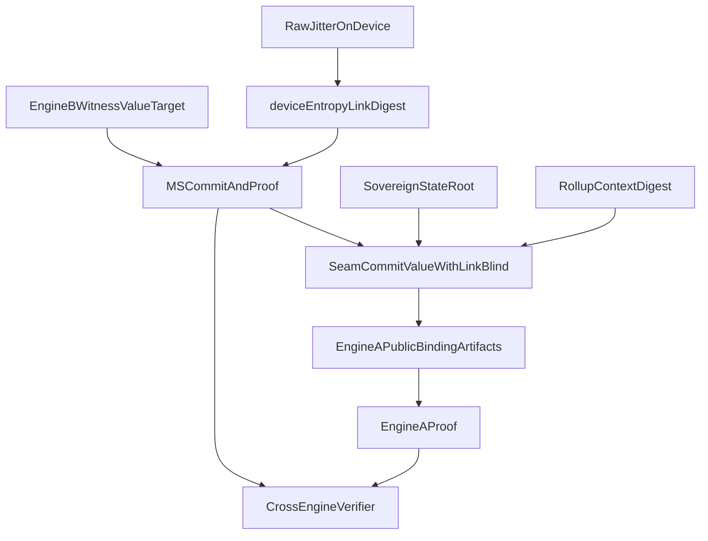

# Engine-B to Engine-A Binding Seam (Commit-Then-Open)

Status: Normative protocol contract for closing the `EngineABindingOp` gap.

## 1. Scope and threat model

This specification defines the cryptographic seam between:

- Engine B (`qssm-ms`): predicate proof (`value > target`) and Merkle root commitments.
- Engine A (`qssm-le`): sovereign public-binding commitment and Lyubashevsky-style proof surface.

Goal: a prover cannot present a valid Engine B statement unless the same hidden value relation is bound into Engine A public commitments under the same rollup context and entropy link.

Adversary model includes:

- Cross-engine replay (`ms` proof copied into a different Engine A context).
- Substitution (`value`/`target` relation valid in B but not tied to A state commitment).
- Malleability on transcript inputs (domain collisions, context swaps, blind reuse across contexts).

## 2. Normative seam invariants

A valid cross-engine proof package MUST satisfy all of the following:

1. Binding correctness: the Engine B witness relation maps to the same state commitment lineage consumed by Engine A.
2. Transcript coherence: both engines bind the same `rollup_context_digest`.
3. Entropy coherence: the MS FS `entropy` input uses the same digest selected by `SovereignLimbV2Params::ms_ledger_entropy_digest`.
4. Blind integrity: seam commitments are blinded by `device_entropy_link` (or explicit fallback policy when absent).
5. Public minimality: only commitments and challenge digests are public; raw witness values remain private.

## 3. Commit-then-open seam flow

Normative sequence:

1. Prover obtains on-device raw entropy and computes `device_entropy_link = blake3(raw)`.
2. Prover produces Engine B proof (`qssm-ms`) with FS entropy set to this link digest (or explicit fallback digest when link is absent).
3. Prover computes seam commitment:  
   `C_seam = H(DOMAIN_SEAM_COMMIT_V1 || state_root || ms_root || relation_digest || device_entropy_link || rollup_context_digest)`.
4. Prover emits Engine A-facing public artifact set containing `C_seam` and required digest lanes.
5. Verifier checks:
   - Engine B verify success.
   - Engine A verify success.
   - Seam commitment recomputes exactly from agreed public inputs and transcript-bound fields.

## 4. Domain separation (required)

Implementations MUST use unique domain tags for seam material and MUST include:

- engine identifier (`ms` vs `le`),
- protocol version,
- `rollup_context_digest`,
- state root / ms root references,
- challenge linkage fields.

Recommended tags:

- `QSSM-SEAM-COMMIT-v1`
- `QSSM-SEAM-OPEN-v1`
- `QSSM-SEAM-BINDING-v1`

## 5. Required input/output contract (protocol-level)

Seam input set (private/public mixed):

- Private: witness-side relation payload from Engine B path (value-side material).
- Public: `state_root`, `ms_root`, `rollup_context_digest`, `ms_fs_v2_challenge`.
- Secret blinding digest: `device_entropy_link` (digest is secret-derived; raw jitter never exported).

Seam output set (public):

- `seam_commitment_digest` (32 bytes),
- optional coefficient-vector lanes for Engine A public binding,
- deterministic transcript bytes for recomputation.

## 6. Failure conditions (hard reject)

Reject the package if any of these hold:

- Engine B verify fails.
- Engine A verify fails.
- `rollup_context_digest` mismatch between engines.
- `ms` FS entropy does not match seam-selected link digest.
- seam commitment digest mismatch.
- domain tag/version mismatch.

## 7. Mapping to current code surfaces

Current seam surfaces are in:

- `crates/qssm-gadget/src/circuit/poly_ops.rs`
  - `EngineABindingOp` (currently contract stub)
  - `MsGhostMirrorOp` (MS verification adapter)
  - `PublicBindingContract` / `BindingReservoir`
  - `SovereignLimbV2Params::ms_ledger_entropy_digest`

This document defines the normative behavior that a non-stub `EngineABindingOp` MUST implement.

## 8. Privacy boundary

- Raw jitter is device-local only.
- `device_entropy_link` digest is used as blind input; never expose raw entropy bytes.
- Public artifacts are commitment digests and transcript-bound metadata only.
- If the link digest leaks broadly, privacy margins degrade; implementations SHOULD scope link lifetime per proving session.
