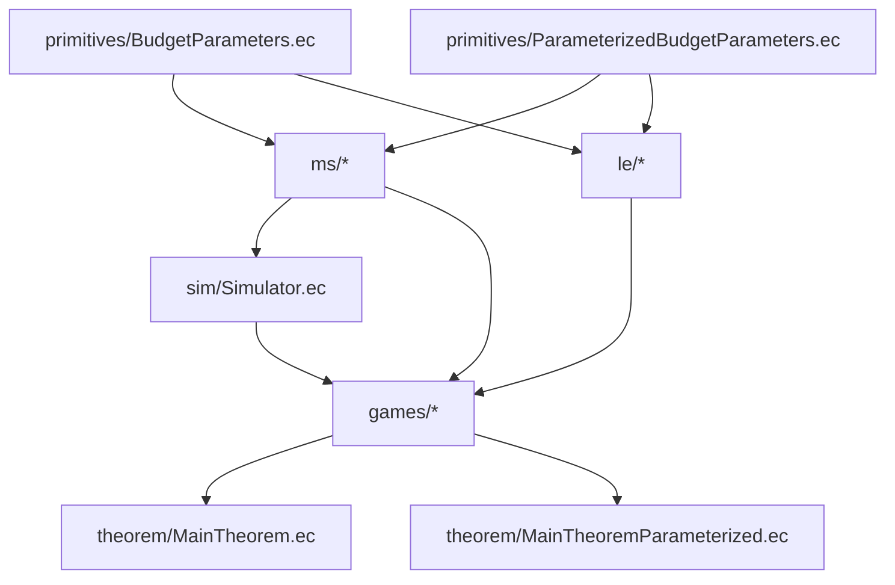

# Proof Dependency Graph

Navigation: [EasyCrypt README](../README.md)

## Purpose

This document gives external reviewers a route-by-route view of how the frozen EasyCrypt proof surface composes.

Checkpoint snapshot: `./check_easycrypt.sh` is `OK` over 135 checked theories, with `axiom_count=0` and `admit_count=0`.

## Global Split



## Exact-Zero Route

```text
BudgetParameters.ec
  -> GameMSHopComposition.ec : A_G0_to_G1_ms_transition_bound
  -> GameLEBridge.ec : A_G1_to_G2_le_transition_bound
  -> MainTheorem.ec : qssm_main_theorem_skeleton
  -> MainTheorem.ec : qssm_main_theorem
```

## Demo Semantic Route

```text
BudgetParameters.epsilon_ms_hash_binding_semantic
  -> ms/source/SourceHashBindingSemanticSlotMass.ec
  -> ms/source/SourceHashBindingSemanticBridge.ec : A_MS1_hash_binding_execution_owned_semantic_bound
  -> ms/MSProbabilitySurface.ec : A_MS1_hash_binding_semantic_transition_bound
  -> games/GameMSHopTransitions.ec : A_MS1_hash_binding_semantic_transition

BudgetParameters.epsilon_ms_rom_programmability_semantic
  -> ms/comparison/ComparisonPayloadSemanticSlotMass.ec
  -> ms/comparison/ComparisonPayloadSemanticBridge.ec : A_MS2_rom_programming_execution_owned_semantic_bound
  -> ms/MSProbabilitySurface.ec : A_MS2_rom_programming_semantic_transition_bound
  -> games/GameMSHopTransitions.ec : A_MS2_rom_programming_semantic_transition

MS1 semantic route + MS2 semantic route
  -> games/GameMSHopComposition.ec : A_G0_to_G1_ms_semantic_transition_bound

BudgetParameters.epsilon_le_rej_semantic
  -> le/LERejectionSamplerMass.ec
  -> le/LERejection.ec : A_LE_rejection_sampler_semantic_sdist_bound

BudgetParameters.epsilon_le_fs_semantic
  -> le/LEFsProgrammingFailureProbability.ec
  -> le/LEFsProgramming.ec : A_LE_fs_semantic_programming_sampler_sdist_le_bad_branch_mass

LE rejection semantic route + LE FS semantic route
  -> games/GameLEBridge.ec : A_G1_to_G2_le_semantic_transition_bound
  -> games/GameLEBridge.ec : A_G1_to_G2_le_semantic_owned_budget_transition_bound
  -> games/GameLEBridge.ec : A_G1_to_G2_le_semantic_umbrella_transition_bound

Canonical semantic MS route + LE semantic route
  -> theorem/MainTheorem.ec : qssm_main_theorem_semantic_budget_local_mass
  -> theorem/MainTheorem.ec : qssm_main_theorem_semantic_budget_owned
  -> theorem/MainTheorem.ec : qssm_main_theorem_semantic_budget
```

## LE-Only Parameterized Route

```text
ParameterizedBudgetParameters.epsilon_le_rej_parameterized
  -> le/LERejectionSamplerParameterizedCore.ec
  -> le/LERejectionSamplerMassLiveParameterized.ec
  -> le/LERejectionParameterized.ec

ParameterizedBudgetParameters.epsilon_le_fs_parameterized
  -> le/LEFsProgrammingLiveParameterizedCore.ec
  -> le/LEFsProgrammingLiveParameterizedMass.ec

Parameterized rejection midpoint + live parameterized FS bridge
  -> le/LEFsProgrammingParameterizedView.ec
  -> le/LEFsProgrammingParameterized.ec
  -> le/LEStatisticalDistanceParameterized.ec
  -> le/LEHVZKParameterized.ec
  -> games/GameLEBridgeParameterized.ec : A_G1_to_G2_le_semantic_parameterized_budget_transition_bound

Canonical demo semantic MS route + parameterized LE route
  -> theorem/MainTheoremParameterized.ec : qssm_main_theorem_le_parameterized_budget
```

## Full Canonical Parameterized Route

```text
ParameterizedBudgetParameters.epsilon_ms_hash_binding_parameterized
  -> ms/source/SourceHashBindingSemanticSlotMassParameterized.ec
  -> ms/source/SourceHashBindingSemanticLiveParameterizedCore.ec
  -> ms/source/SourceHashBindingSemanticLiveParameterizedMass.ec
  -> ms/source/SourceHashBindingSemanticBridgeParameterized.ec
  -> ms/MSProbabilitySurfaceParameterized.ec : A_MS1_hash_binding_parameterized_public_endpoint_compatibility_bound

ParameterizedBudgetParameters.epsilon_ms_rom_programmability_parameterized
  -> ms/comparison/ComparisonPayloadSemanticSlotMassParameterized.ec
  -> ms/comparison/ComparisonPayloadSemanticLiveParameterizedCore.ec
  -> ms/comparison/ComparisonPayloadSemanticLiveParameterizedMass.ec
  -> ms/comparison/ComparisonPayloadSemanticBridgeParameterized.ec
  -> ms/MSProbabilitySurfaceParameterized.ec : A_MS2_rom_programming_parameterized_public_endpoint_transition_bound
  -> ms/MSProbabilitySurfaceParameterized.ec : A_MS_public_after_rom_to_canonical_after_rom_parameterized_transition_bound
  -> games/GameAdvantageParameterized.ec : A_MS2_rom_programming_parameterized_canonical_game_pr_core_bound
  -> games/GameAdvantageParameterized.ec : A_MS_public_after_rom_to_canonical_after_rom_parameterized_bound
  -> games/GameMSHopTypesParameterized.ec : A_MS2_canonical_rom_programming_parameterized_bound

Live MS1 route + budgeted public-to-canonical MS2 landing
  -> games/GameMSHopCompositionParameterized.ec : A_G0_to_G1_ms_parameterized_transition_bound

Canonical parameterized MS route + parameterized LE route
  -> theorem/MainTheoremParameterized.ec : qssm_main_theorem_parameterized_budget
```

## Staged/Public-Endpoint MS Parameterized Route

```text
ParameterizedBudgetParameters.epsilon_ms_hash_binding_parameterized
  -> ms/source/SourceHashBindingSemanticSlotMassParameterized.ec
  -> ms/source/SourceHashBindingSemanticLiveParameterizedCore.ec
  -> ms/source/SourceHashBindingSemanticLiveParameterizedMass.ec
  -> ms/source/SourceHashBindingSemanticBridgeParameterized.ec

ParameterizedBudgetParameters.epsilon_ms_rom_programmability_parameterized
  -> ms/comparison/ComparisonPayloadSemanticSlotMassParameterized.ec
  -> ms/comparison/ComparisonPayloadSemanticLiveParameterizedCore.ec
  -> ms/comparison/ComparisonPayloadSemanticLiveParameterizedMass.ec
  -> ms/comparison/ComparisonPayloadSemanticBridgeParameterized.ec

Live MS1 staged route + live MS2 staged/landing companion
  -> ms/MSProbabilitySurfaceParameterized.ec
  -> games/GameAdvantageParameterized.ec
  -> games/GameMSHopTypesParameterized.ec
  -> games/GameMSHopCompositionParameterized.ec
```

That route no longer stops below the theorem surface. It remains the internal public-endpoint subroute consumed by the budgeted landing into canonical `Adv_G0_G1_MS`.

## Component Maps

### MS1 semantic route

```text
BudgetParameters.epsilon_ms_hash_binding_semantic
  -> SourceHashBindingSemanticSlotMass.ec
  -> SourceHashBindingSemanticBridge.ec : A_MS1_hash_binding_execution_owned_semantic_bound
  -> MSProbabilitySurface.ec : A_MS1_hash_binding_semantic_transition_bound
  -> GameMSHopTransitions.ec : A_MS1_hash_binding_semantic_transition
  -> GameMSHopComposition.ec : A_G0_to_G1_ms_hash_binding_semantic_transition_bound
```

### MS2 semantic route

```text
BudgetParameters.epsilon_ms_rom_programmability_semantic
  -> ComparisonPayloadSemanticSlotMass.ec
  -> ComparisonPayloadSemanticBridge.ec : A_MS2_rom_programming_execution_owned_semantic_bound
  -> MSProbabilitySurface.ec : A_MS2_rom_programming_semantic_transition_bound
  -> GameMSHopTransitions.ec : A_MS2_rom_programming_semantic_transition
  -> GameMSHopComposition.ec : A_G0_to_G1_ms_semantic_transition_bound
```

### LE rejection semantic route

```text
BudgetParameters.epsilon_le_rej_semantic
  -> LERejectionSamplerMass.ec
  -> LERejection.ec : A_LE_rejection_sampler_semantic_experiment_sdist_le_failure_probability
  -> LERejection.ec : A_LE_rejection_sampler_semantic_sdist_bound
  -> LEStatisticalDistance.ec
  -> GameLEBridge.ec
```

### LE FS semantic route

```text
BudgetParameters.epsilon_le_fs_semantic
  -> LEFsProgrammingFailureProbability.ec : le_fs_shadow_local_bad_branch_mass
  -> LEFsProgramming.ec : A_LE_fs_semantic_programming_sampler_sdist_le_bad_branch_mass
  -> LEStatisticalDistance.ec
  -> GameLEBridge.ec
```

### Parameterized LE route

```text
ParameterizedBudgetParameters.epsilon_le_parameterized
  <- epsilon_le_rej_parameterized + epsilon_le_fs_parameterized
  <- LERejectionSamplerMassLiveParameterized.ec and LEFsProgrammingLiveParameterizedMass.ec
  -> LERejectionParameterized.ec, LEFsProgrammingParameterized.ec, and LEFsProgrammingParameterizedView.ec
  -> LEStatisticalDistanceParameterized.ec
  -> LEHVZKParameterized.ec
  -> GameLEBridgeParameterized.ec
  -> MainTheoremParameterized.ec
```

### MS1 live parameterized route

```text
ParameterizedBudgetParameters.epsilon_ms_hash_binding_parameterized
  -> SourceHashBindingSemanticSlotMassParameterized.ec
  -> SourceHashBindingSemanticLiveParameterizedCore.ec : live coupled-state/public-observable core
  -> SourceHashBindingSemanticLiveParameterizedMass.ec : canonical failure at 3/32 and public-divergence upper at 1/16
  -> SourceHashBindingSemanticBridgeParameterized.ec : preserved bridge facts delegated to the live lane
  -> MSProbabilitySurfaceParameterized.ec
  -> GameAdvantageParameterized.ec
  -> GameMSHopTypesParameterized.ec
  -> GameMSHopCompositionParameterized.ec
```

## Honest Boundary

The dependency graph remains intentionally split. The public theorem surface now includes both the LE-only intermediate parameterized theorem and the full canonical parameterized theorem, while the internal staged/public-endpoint MS route remains visible because the canonical closure still depends on a charged public-to-canonical bridge rather than a zero-cost identification. On both the MS1 and MS2 halves, that staged route is now carried by live parameterized lower lanes. No remaining localized replay seams are expected on the current uniform finite-support / contiguous-layout profile family.