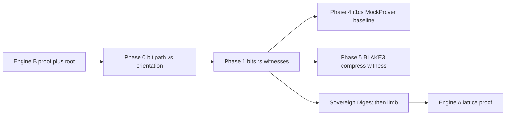

### **The QSSM Protocol Family Series**
* **Overview:** [The Architecture of Sovereignty](./architecture-overview.md)
* **Integration (B→A):** [BLAKE3–Lattice Gadget](./blake3-lattice-gadget-spec.md)

---

# BLAKE3–Lattice Gadget — Rust implementation plan

This document is the **normative implementation plan** for [`blake3-lattice-gadget-spec.md`](./blake3-lattice-gadget-spec.md). **Math is law:** there is no “primitives first, decomposition later” shortcut—**bit decomposition and degree‑2 algebra are mandatory from the first line of `bits.rs`.**

---

## Mandatory requirements (normative)

### 1. Algebraic primitives (`bits.rs`) — degree‑2 R1CS compatibility

All bit/word logic exposed from **`bits.rs`** must be expressible as **degree‑2** constraints over \(\{0,1\}\) (or small integers) in a future R1CS embedding.

| Rule | Requirement |
|------|-------------|
| **XOR** | **Must** use **\(x \oplus y = x + y - 2xy\)** on bit witnesses ([`constraint_xor`]). The **normative** witness path **must not** use `^` / `bitxor` for exported witnesses—tests may assert against `^` only for equality checks. |
| **AND / OR** | **AND** = **\(xy\)**; **OR** on bits = **\(a + b - ab\)**. |
| **Addition** | **Must not** use `wrapping_add` (or any single native “add”) as the **definition** of `u32` addition in the witness API. **Must** use a **ripple‑carry adder** from **[`FullAdder`]** at every bit, with **[`RippleCarryWitness`]** holding **all** stages. |
| **Full adder** | **[`FullAdder`]** **must** expose **`sum`**, **`carry_out`**, **`a`**, **`b`**, **`cin`** as explicit wires. Carries **must** chain bit‑to‑bit—no collapsed carry. |
| **Phase‑1 / Phase‑2 sync (schedule)** | **Phase 1** implementation **includes** witness structs (**[`XorWitness`]**, **[`RippleCarryWitness`]**, `validate()`) **from day one**. There is **no** separate “Phase 1 = raw ops only, Phase 2 = structs later.” Decomposition and **\(x+y-2xy\)** are **not optional follow‑ons**—they **are** Phase 1. |

---

### 2. Endianness safety (Little‑Endian bit decomposition)

**Strict rule:** **`bits[i]`** is the bit with weight **\(2^i\)** (**LSB at `i == 0`**). This matches **little‑endian** **`u32`** ↔ bytes and **must** stay **bit‑for‑bit** consistent with the **BLAKE3** reference’s 32‑bit word operations.

- **`to_le_bits` / `from_le_bits`** are the **only** canonical word↔bit serialization unless a docstring defines an exception.
- **Phase 1** **starts** with LE decomposition: every higher‑level gadget (**XOR witness**, ripple add, and later BLAKE3 wiring) **must** obtain words **only** through these bits (or explicit permutations thereof)—**no** parallel “integer‑only” code path that skips bits for production witnesses.
- Unit tests **must** include **LE byte** cross‑checks (e.g. `0xAABBCCDD` vs `to_le_bytes()` per bit index).

---

### 3. Commitment-binding security — **Sovereign Digest** (not raw root, not simple mod)

**Rule:** Engine A’s public message **`m`** **must not** be:

- the raw Merkle **root**, or  
- **`root mod 2^{30}`**, or  
- any **simple modular reduction** of the root alone.

**Sovereign Digest (normative intent):** **`m`** is derived only after hashing the **full** cross‑engine binding input—see **§5** for the operational limb step.

---

### 4. Phase 0 — Merkle internal consistency (`merkle.rs`) — **mandatory bit‑path match**

Before **`recompute_root`** (or any hash chaining), **`merkle.rs` must**:

1. Treat **`leaf_index`** as defining a **bit path** in the binary tree: at each level **ℓ** (0…**depth−1**), whether the running node is the **left** or **right** child is **fixed** by **LE** decomposition of the index—use **`to_le_bits(leaf_index as u32)[ℓ]`** (for depth 7 and **`leaf_index < 128`**) to obtain the **mandatory** “acc on right” parity for that level, **or** an equivalent formulation **derived from the same LE bits** (no ad‑hoc `(idx&1)` without tying it to **`leaf_index`**’s bit path).
2. **Verify** that this **bit‑derived** parity sequence **matches** the **physical sibling orientation** at each level: i.e. the same left/right placement of **`acc`** vs **`sibling`** as **`verify_path_to_root`** in **`qssm-ms`** (when **`acc`** is on the right, **`leaf_index`**’s bit at that level **must** be **1**, and symmetrically for left / **0**).
3. On mismatch, return **`GadgetError::IndexMismatch`** and **abort**—**do not** hash upward.

Optional cross‑checks (e.g. Engine B **`k`**, **`bit_at_k`** with **`leaf_index == 2k + bit_at_k`**) are **recommended** and may produce **`IndexMismatch`** / **`MsOpeningMismatch`**.

---

### 5. Sovereign Digest — **hash root + context (+ metadata), then limb extraction**

This section replaces any notion of “take **`root % 2^{30}`**” or other **unhashed** truncation. **Limb extraction applies only to the digest of the full binding input.**

**Normative pipeline:**

1. **Compute**  
   **`SovereignDigest = H(domain_tag ‖ Root ‖ RollupContext ‖ ProofMetadata)`**  
   using the project’s **`hash_domain`** (or equivalent domain‑separated BLAKE3):  
   - **`Root`**: 32 B Merkle root (committed Engine B state).  
   - **`RollupContext`**: **`rollup_context_digest`** (32 B).  
   - **`ProofMetadata`**: fixed schema of Engine B fields required for non‑malleability (e.g. **`n`**, **`k`**, **`challenge`**, FS‑bound fields)—exact chunk order **fixed in code** and golden tests.

2. **Only then** extract **`m`**: the **first 30 bits** of **`SovereignDigest`** in **LE** order via **explicit bit decomposition** (see **Phase 3**); **no** **`mod 2^{30}`** / mask‑only shortcut on the **witness API** without bit‑equivalent construction.

3. **Security posture:** Pre‑hashing **binds** **`m`** to **root + rollup + metadata**, so **30‑bit** outputs are **not** raw root snippets—collision and malleability risk is reduced versus embedding or naïvely reducing the root.

4. **`SovereignWitness`:** holds inputs, **`digest`**, limb bits, and **`message_limb`**; **`validate()`** recomputes hash and limb (**Phase 3**).

**Forbidden in normative APIs:** **`m = root mod 2^{30}`**, **`m = truncate(root)`** without the **Sovereign Digest** step above.

---

## Sovereign integration path (end state)

1. **`qssm-gadget`** verifies Engine B where applicable (`qssm_ms::verify` / Merkle).
2. **Phase 0** enforces **leaf_index** ↔ **LE bit path** ↔ **sibling orientation** before any **`merkle_parent`** chain.
3. **Phase 1** (**`bits.rs`**) uses **degree‑2** XOR and **ripple** witnesses **from day one**—**always** with LE decomposition.
4. **`SovereignDigest`** (§3, §5) is computed; **30‑bit** **`m`** follows **only** from that digest.
5. **Phase 4** (**`r1cs.rs`**) provides the **normative constraint IR** and **`MockProver`** baseline counts on top of the same witnesses (parallel to the B→A limb path).
6. **Phase 5** (**`blake3_compress.rs`**) witnesses **full BLAKE3 `compress`** (Merkle parent via **`hash_domain(DOMAIN_MERKLE_PARENT, …)`**).
7. Engine A lattice proof closes the statement.

---

## Phases (rewritten — no lazy staging)

| Phase | Focus | Exit criteria |
|-------|---------|----------------|
| **0** | **`merkle.rs`**: **mandatory** LE bit‑path vs **sibling orientation** per level; **`IndexMismatch`** if not; then **`recompute_root`**. | MS tests; tamper / wrong index negatives. |
| **1** | **`bits.rs`**: **`to_le_bits`**, **`constraint_xor` (\(x+y-2xy\))**, **`FullAdder`**, **`ripple_carry_adder`**, **`XorWitness`**, **`RippleCarryWitness`**, **`validate()`**—**one** phase, **day one**. | No `wrapping_add` on add witness API; LE byte tests. |
| **2** | **`blake3_native.rs`**: BLAKE3 **G‑function** and quarter‑round **only** via **`XorWitness`**, **`RippleCarryWitness`**, **`bit_wire_rotate`**, and **witness chaining** (normative structure below). | Vectors vs **`blake3`** / **`hash_domain`**; Merkle‑parent preimage path. |
| **3** | **`binding.rs`**: **Sovereign Digest** per **Phase 3** (input schema, **`DOMAIN_SOVEREIGN_LIMB_V1`**, LE limb via **bit decomposition**, **`SovereignWitness`**). | Golden vectors; **`PublicInstance::validate`**; witness **`validate()`** round‑trip. |
| **4** | **`r1cs.rs`**: normative **constraint IR** — **`ConstraintSystem`**, **`Blake3Gadget::synthesize_g`**, **`MockProver`** baseline counter; real provers implement the same trait. | **`test_blake3_g_constraint_cost`** locks **G** cost; optional benches. |
| **5** | **`blake3_compress.rs`**: **`MSG_SCHEDULE`**, **`CompressionWitness`** (**56 × `G`** / compress), **`hash_merkle_parent_witness`**; **`Blake3Gadget::synthesize_compress`** / **`synthesize_merkle_parent_hash`**. | **`test_full_merkle_parent_parity`**: digest **bit-for-bit** vs **`qssm_utils::merkle_parent`**; **MockProver** full-chain count locked (**65 184**). |

---

## Phase 5 — Compression engine & Merkle parent witness (`blake3_compress.rs`)

**Math is law:** One BLAKE3 **`compress`** matches the [reference `compress` / `round` / `permute`](https://github.com/BLAKE3-team/BLAKE3/blob/master/reference_impl/reference_impl.rs): **7** rounds, **8** **`G`** applications per round (**56** total per compress), **`MSG_PERMUTATION`** on the **16** message words **between** rounds (**no arithmetic** on schedule indices—only **public** permutation / **copy** wiring).

### **`MSG_SCHEDULE` and quarter-round order**

- **`ROUND_G_LANES`**: the **eight** `(state indices a,b,c,d, mx_word, my_word)` tuples per **`round`** (column **G**s then diagonal **G**s), identical to the reference **`round`** function.
- **`MSG_SCHEDULE`**: **7 × 8** pairs **`(mx_word, my_word)`** into the **current** 16-word message block; the **same eight pairs** apply every round because **`MSG_PERMUTATION`** reshuffles **words** between rounds (normative BLAKE3).
- **`MSG_SCHEDULE_ROW`** / **`MSG_SCHEDULE`**: `[(0,1),(2,3),…,(14,15)]` repeated **7** times in code for auditability.

### **`CompressionWitness`**

- **Fields:** **`chaining_value`**, **`block_words_initial`**, **`counter_low` / `counter_high`**, **`block_len`**, **`flags`**, **`g_steps: [[QuarterRoundWitness; 8]; 7]`**, **`output_words: [u32; 16]`** after feed-forward XOR.
- **`build` / `validate()`:** **`validate`** checks every nested **`GWitness`** and compares **`output_words`** to **`compress_native`** (oracle).

### **Merkle parent — `hash_merkle_parent_witness`**

- **Target:** **`qssm_utils::merkle::merkle_parent(left, right)`** = **`hash_domain(DOMAIN_MERKLE_PARENT, &[left‖right])`** (UTF‑8 domain prefix then **64**-byte chunk).
- **Two compresses** (single-chunk **`Hasher`** path for this preimage length): **(1)** first **64** bytes of **`domain ‖ left ‖ right`** with **`CHUNK_START`**; **(2)** remaining tail with **`CHUNK_END | ROOT`** (same **partial block** layout as the reference **`Output::root_output_bytes`** compress).
- **`MerkleParentHashWitness`:** **`compress_chunk_start`** + **`compress_root`**; **`digest()`** = first **32** bytes of **`compress_root.output_words`** (LE).

### **Constraint budget (`MockProver`)**

- Per **`compress`:** **56 × 518** (**`synthesize_g`**) + **6 × 512** (**message word permute**, **32** bits × **16** words) + **16 × 32** (**finalize XOR** bit hooks) = **32 592**.
- **Full Merkle parent:** **2 × 32 592 = 65 184** (**`synthesize_merkle_parent_hash`**). Regression-locked in **`test_full_merkle_parent_parity`**.

### **Exit criteria (Phase 5)**

- Golden **`test_full_merkle_parent_parity`**: **`merkle_parent`** vs witness **`digest()`** **byte- and bit-equal**; **`println!`** sovereign machine constraint count.
- **`CompressionWitness::validate`** and unit tests vs **`compress_native`**.

---

## Phase 4 — Normative constraint IR & **`MockProver`** baseline (`r1cs.rs`)

Phase 4 is **no longer** an unspecified “stub”: the **gadget constraint IR** is **normative** in code. It bridges Phase 1–2 **witness structs** (still defined only in **`bits.rs`** / **`blake3_native.rs`**) to a formal **`ConstraintSystem`** API without changing witness semantics.

- **`ConstraintSystem`** (normative methods): **`allocate_variable`**, **`enforce_xor`** (boolean XOR with explicit AND wire, consistent with **`XorWitness`**), **`enforce_full_adder`**, **`enforce_equal`** (rotations / copies).
- **`MockProver`**: reference implementation of **`ConstraintSystem`**; **`constraint_count()`** increments **once per `enforce_*`** — this is the **baseline cost metric** for regressions until a real backend lands.
- **`Blake3Gadget::synthesize_g`**: walks **`GWitness`** in the **same order** as **`g_function`** (Phase 2) and emits constraints for XORs, ripple adds, and bit rotations.
- **`Blake3Gadget::synthesize_compress`** / **`synthesize_merkle_parent_hash`** (Phase 5): full **`CompressionWitness`** and **`MerkleParentHashWitness`** chains into **`MockProver`** (see **Phase 5**).
- **Exit test:** **`test_blake3_g_constraint_cost`** — build **`GWitness`** via **`g_function`**, run **`Blake3Gadget::synthesize_g`**, assert a **fixed** constraint total (documented in the test). **Optional benches** remain for future throughput work; they do not replace the **MockProver** baseline.

Phase 3 **Sovereign Digest** / **`SovereignWitness`** ( **`binding.rs`** ) stays the normative **B→A message limb** path; future work may **emit** limb/digest wiring through the same **`ConstraintSystem`** pattern.

---

## Phase 2 — BLAKE3 G‑function (normative structure)

**Math is law:** The mixing **G‑function** (as used inside BLAKE3’s **compress** / quarter‑round on **`u32`** lanes) **must not** be implemented with a hidden “native `u32` quarter‑round” on the **witness path**. Every **Add**, **XOR**, and **Rotate** step is exposed as **explicit, chainable witness data** built **only** from Phase 1 types.

### Algebraic composition (Add + XOR only from Phase 1)

The four conceptual steps of the **G‑function** on two 32‑bit lanes (and the analogous steps in a full quarter‑round) reduce to:

1. **Add (mod \(2^{32}\))** — **must** be a **fresh** **`RippleCarryWitness`** (or a thin wrapper whose **only** nonlinear payload is a **`RippleCarryWitness`**) taking **LE** input bit arrays derived from prior chain outputs via **`to_le_bits`** / **`from_le_bits`**. **Forbidden:** `wrapping_add`, `+` on **`u32`**, or any single-instruction add as the **definition** of the witness.
2. **XOR** — **must** be a **fresh** **`XorWitness`** on the **LE** bit arrays of the two operands (each operand is the **output bits** of the immediately preceding witness node in the chain, or initial decomposed words).
3. **Repeat** add / xor per the BLAKE3 **quarter‑round** ordering (rotation **offsets** and step order from the BLAKE3 spec; **fixed** in code and covered by tests).

**Rotate** is **not** a third algebraic primitive in **`bits.rs`**; it is a **wire permutation** (see below). After each **rotate**, the **output** is a **new** `[bool; 32]` (or a dedicated witness struct holding it) that feeds the **next** **`XorWitness`** / **`RippleCarryWitness`**.

### Explicit rotations — `bit_wire_rotate`

**Function (normative API shape):**

`bit_wire_rotate(bits: [bool; 32], offset: u8) -> BitRotateWitness`

- **Semantics:** **`out_bits[i] = bits[index(i)]`** where **`index(i)`** is a **pure re‑indexing** of positions **`0..32`** (a permutation). For a **right** rotation by **`r`** bit positions in the **LE** lane convention, use the index map that matches BLAKE3 **`ROTR`** on **`u32`** (e.g. **`out_bits[i] = bits[(i + r) % 32]`** once the LE convention is aligned—**must** be verified against **`blake3`** test vectors).
- **Forbidden on the witness path:** **`rotate_right`**, **`<<`**, **`>>`**, or any **arithmetic** rotate on **`u32`** to **materialize** the witness; the **only** allowed mechanism is **copying** / **wiring** bits by **index**.
- **`BitRotateWitness`** (name illustrative) **must** retain **`in_bits`**, **`out_bits`**, and **`offset`** (or the full **32‑entry index map**) so an R1CS backend can emit **copy** / **permutation** constraints without introducing multiplicative degree.

### Witness chaining (no overwrite)

- **Rule:** Each **Add** or **XOR** in the G‑function **creates a new** witness struct instance (**new** **`RippleCarryWitness`**, **new** **`XorWitness`**). **Do not** mutate or reuse a single struct to represent successive steps.
- **Rule:** Outputs are **named** as successive stages (e.g. **`stage_k_sum`**, **`stage_k_xor`**) held in a **vector** or **explicit struct-of-structs** (e.g. **`QuarterRoundWitness { adds: [...], xors: [...], rotates: [...] }`**) where each field is an **owned** sub‑witness, not a reference overwritten in place.
- **Rationale:** Preserves **one R1CS variable per wire** and matches **fresh‑witness** degree‑2 discipline from the integration spec.

### Exit criteria (Phase 2)

- **Unit tests:** **`bit_wire_rotate`** + **`XorWitness`** + **`RippleCarryWitness`** composed into at least one full **quarter‑round** match **`blake3`** reference **`u32`** outputs on golden inputs.
- **Integration:** Fixed **64‑byte** Merkle‑parent **`hash_domain`** path (domain prefix **constant**) matches **`qssm_utils::merkle_parent`** on test vectors.

---

## Phase 3 — Sovereign Digest / **`binding.rs`** (normative structure)

**Math is law:** The Engine A message limb **`m`** is derived **only** from a **domain‑separated** digest over a **fixed‑order** preimage. **No** raw root, **`root % 2^{30}`**, or **`u32 & ((1<<30)-1)`** as the **normative definition** of the limb—limb bits **must** come from **explicit LE bit decomposition** (and masking via **bit selection** / **`from_le_bits`** on a **30‑bit‑padded** witness), matching Phase 1 discipline.

### Input schema — exact **`hash_domain`** preimage order

The reference uses **`qssm_utils::hashing::hash_domain(domain, chunks)`**, which defines the BLAKE3 preimage as:

**`UTF8(domain_tag) ‖ chunk₀ ‖ chunk₁ ‖ chunk₂`**

with **no** implicit reordering. **Normative mapping:**

| Segment | Role | Length / type |
|---------|------|----------------|
| **`domain_tag`** | Protocol‑unique string (**`DOMAIN_SOVEREIGN_LIMB_V1`**, below) | UTF‑8 bytes (not NUL‑terminated in hash) |
| **`chunk₀`** | **Merkle root** | **32** bytes |
| **`chunk₁`** | **Rollup context** | **`rollup_context_digest`**, **32** bytes |
| **`chunk₂`** | **Proof metadata** | **Variable**, **canonical** encoding (fixed field order below) |

**Forbidden:** Passing **`root`**, **`rollup`**, or **`metadata`** in a different order; omitting **`domain_tag`** from **`hash_domain`**’s first argument and stuffing it inside **`chunks`** unless the implementation is proven byte‑identical to the table above.

**`ProofMetadata` (normative field order for Engine B v1):** encode as a single contiguous byte array in this order (adjust version suffix in constant if this schema bumps):

1. **`n`** — **`u8`** (MS nonce),  
2. **`k`** — **`u8`** (bit index),  
3. **`bit_at_k`** — **`u8`**,  
4. **`challenge`** — **`[u8; 32]`** (Fiat–Shamir bytes from **`GhostMirrorProof`**).

Additional FS‑bound fields (e.g. **`value`**, **`target`**, **`context`** length‑prefixed) **may** be appended in a **documented** v2 schema; v1 **must** match the four fields above for cross‑implementation tests.

### Domain separation — **`DOMAIN_SOVEREIGN_LIMB_V1`**

- **Normative string (exact, case‑sensitive):** **`QSSM-SOVEREIGN-LIMB-v1.0`**
- **Purpose:** Binds the digest to the **Sovereign limb** construction so preimage cannot be confused with **`DOMAIN_MS`**, **`DOMAIN_MERKLE_PARENT`**, **`QSSM-LE-FS-LYU-v1.0`**, or other **`hash_domain`** users.
- **Rule:** **Do not** reuse this string for non‑limb hashes; **do not** alias another domain string to the same UTF‑8 bytes.

### Limb extraction — **first 30 bits**, LE‑consistent, **no `mod 2^{30}` shortcut**

Let **`D = SovereignDigest`** be **`[u8; 32]`** (**256** bits).

1. **Flatten `D` to LE bit indices `0..255`:** bit **`j`** has weight **`2^j`** in the usual **little‑endian byte order** (`bit 0` = LSB of **`D[0]`**, …, **`bit 7`** = MSB of **`D[0]`**, **`bit 8`** = LSB of **`D[1]`**, etc.). Implementation **may** obtain indices **`0..29`** by decomposing **`D[0]`, `D[1]`, `D[2]`** and the **lower six bits** of **`D[3]`** only (equivalent to the low **30** bits of the **256‑bit LE** integer).
2. **Normative limb construction:** Build a **30‑bit** value **`m`** as  
   **`m = Σ_{i=0}^{29} b_i · 2^i`**  
   where **`b_i`** are the **boolean** bits from step **1** (same indices).  
3. **Witness / R1CS path:** Express extraction as **`to_le_bits`** on the relevant bytes (or per‑byte decomposition) **then** **select** **`b_0..b_{29}`** into a **padded** **`[bool; 32]`** with **`b_{30} = b_{31} = false`**, then **`m = from_le_bits(&padded)`** as **`u64`** (fits **`0 ≤ m < 2^{30}`**).
4. **Forbidden as normative definition of the limb:** `digest_u32 % (1<<30)`, **`w & ((1<<30)-1)`** without an **explicit** bit‑decomposition step in the **public witness API**; any **`&` mask** in optimized code **must** be **test‑equivalent** to the **bit‑wise** construction above.

### Validator — **`SovereignWitness`**

**`SovereignWitness`** (name normative) **must** hold **everything** needed to re‑verify the binding **in one pass**:

| Field / group | Content |
|---------------|---------|
| **Inputs (copy or reference)** | **`root`**, **`rollup_context_digest`**, **`proof_metadata`** bytes actually hashed |
| **`domain_tag`** | **`DOMAIN_SOVEREIGN_LIMB_V1`** (or fixed `&'static str`) |
| **`digest`** | Output **`[u8; 32]`** of **`hash_domain`** |
| **`limb_bits`** | The **30** selected booleans (and optional padding witness to **32** bits) |
| **`message_limb`** | **`u64`** in **`[0, 2^{30})`** |

**`validate(&self) -> bool` (or `Result`):**

1. Recompute **`digest' = hash_domain(domain_tag, &[root, rollup, metadata])`** and assert **`digest' == self.digest`**.  
2. Recompute **`m'`** from **`digest'`** using the **normative bit extraction** (§ above) and assert **`m' == self.message_limb`** and consistency of **`limb_bits`**.

**Rationale:** Enables a single **struct** for audits, tests, and future R1CS “bind **`m`** to digest” constraints without hidden state.

### Exit criteria (Phase 3)

- **Unit tests:** Golden **`hash_domain`** preimage (known **`root`**, **`rollup`**, **`metadata`**) → known **`digest`** (optional: vs **`blake3`** manual call) → **`message_limb`** equals **bit‑constructed** value.  
- **Integration:** **`PublicInstance::validate`** accepts **`message_limb`** for **`qssm-le`**.  
- **`SovereignWitness::validate`** passes on happy path; fails if **`root`** or **`metadata`** is tampered.

---

## Key files (rewritten)

| File | Responsibility |
|------|----------------|
| [`crates/qssm-gadget/Cargo.toml`](crates/qssm-gadget/Cargo.toml) | Crate manifest; `qssm-utils`, `thiserror`; `blake3` dev for vectors. |
| [`crates/qssm-gadget/src/lib.rs`](crates/qssm-gadget/src/lib.rs) | `bits`, `merkle`, `binding`, `blake3_native`, **`r1cs`**, `error`; re‑exports **`ConstraintSystem`**, **`MockProver`**, **`Blake3Gadget`**. |
| [`crates/qssm-gadget/src/bits.rs`](crates/qssm-gadget/src/bits.rs) | Degree‑2 XOR, **`FullAdder`**, ripple + **`XorWitness` / `RippleCarryWitness`** from **day one**; LE only. |
| [`crates/qssm-gadget/src/merkle.rs`](crates/qssm-gadget/src/merkle.rs) | **Phase 0** LE path ↔ orientation; **`recompute_root`**. |
| [`crates/qssm-gadget/src/binding.rs`](crates/qssm-gadget/src/binding.rs) | **Phase 3**: **`hash_domain(DOMAIN_SOVEREIGN_LIMB_V1, [root‖rollup‖metadata])`**, LE **30‑bit** limb from **`to_le_bits`**, **`SovereignWitness`**. |
| [`crates/qssm-gadget/src/blake3_native.rs`](crates/qssm-gadget/src/blake3_native.rs) | G‑function / quarter‑round: **`XorWitness`**, **`RippleCarryWitness`**, **`bit_wire_rotate`**, **`BitRotateWitness`**, chained **`QuarterRoundWitness`** (no native `u32` mix on witness path). |
| [`crates/qssm-gadget/src/blake3_compress.rs`](crates/qssm-gadget/src/blake3_compress.rs) | **Phase 5**: **`MSG_SCHEDULE`**, **`CompressionWitness`** (**56 × `G`**), **`hash_merkle_parent_witness`**, **`compress_native`** oracle. |
| [`crates/qssm-gadget/src/r1cs.rs`](crates/qssm-gadget/src/r1cs.rs) | **Phase 4–5**: **`ConstraintSystem`**, **`MockProver`**, **`Blake3Gadget::synthesize_g`**, **`synthesize_compress`**, **`synthesize_merkle_parent_hash`**. |
| [`crates/qssm-gadget/src/error.rs`](crates/qssm-gadget/src/error.rs) | **`GadgetError`** variants. |
| [`crates/qssm-gadget/tests/`](crates/qssm-gadget/tests/) | MS + digest golden + **`full_merkle_parent_parity`** (Merkle parent **bit** parity + constraint count). |

---

## Workspace / crate layout (summary)

| Item | Notes |
|------|--------|
| Workspace | Add **`crates/qssm-gadget`** to root **`Cargo.toml`** `members`. |
| **`qssm-ref`** | Optional **`qssm-gadget`** when integration binaries need it. |

---

## Documentation sync

- Align [`blake3-lattice-gadget-spec.md`](./blake3-lattice-gadget-spec.md) §5.2 with **§5** here (Sovereign Digest before limb).
- This file is the **implementation** law; the spec is **design** normative.

---

## Implementation todos (aligned — no split “structs later”)

1. Scaffold **`qssm-gadget`** + workspace + **`error`**.  
2. **`merkle.rs`**: Phase 0 **LE bit path** vs **orientation**; **`recompute_root`**.  
3. **`bits.rs`**: **Phase 1 unified** — primitives **and** **`XorWitness` / `RippleCarryWitness` / `validate`** **together**.  
4. **`blake3_native.rs`**: **`bit_wire_rotate`**, G‑function via **fresh** **`XorWitness` / `RippleCarryWitness`** chain; quarter‑round + Merkle‑parent vectors (Phase 2 section).  
5. **`binding.rs` (Phase 3):**  
   - Implement **`encode_proof_metadata_v1(n, k, bit_at_k, challenge)`** → **`Vec<u8>`** in the **normative field order** (Phase 3 **`ProofMetadata`**).  
   - Limb: **LE** first **30** bits via **`to_le_bits`** / padded **`[bool; 32]`** + **`from_le_bits`** (no mask‑only normative API; optimized code **must** match bit construction in tests).  
   - Add **`SovereignWitness`** + **`validate()`** (recompute **`hash_domain`**, rederive **`message_limb`**, check **`limb_bits`**).  
   - Golden tests: fixed **`root`/`rollup`/`metadata`** → **`digest`** → **`m`**; **`PublicInstance::validate`** smoke.  
6. **Phase 4 (done — normative):** **`r1cs.rs`** — **`ConstraintSystem`**, **`MockProver`** as **baseline** cost counter, **`Blake3Gadget::synthesize_g`**, **`test_blake3_g_constraint_cost`**; optional benches + spec cross‑links as follow‑ons.  
7. **Phase 5 (done — compression engine):** **`blake3_compress.rs`** — **`MSG_SCHEDULE` / `MSG_PERMUTATION`**, **`CompressionWitness`**, **`hash_merkle_parent_witness`** (two compresses = **`merkle_parent`** path); **`r1cs`**: **`synthesize_compress`**, **`synthesize_merkle_parent_hash`**; **`tests/full_merkle_parent_parity.rs`** locks **65 184** **`MockProver`** units and **bit-for-bit** digest parity vs **`qssm_utils`**.

---

## Updated text for Sections 2, 3, and 5 (verbatim blocks)

### Section 2 — Endianness safety (Little‑Endian bit decomposition)

**Strict rule:** **`bits[i]`** is the bit with weight **\(2^i\)** (**LSB at `i == 0`**). This matches **little‑endian** **`u32`** ↔ bytes and **must** stay **bit‑for‑bit** consistent with the **BLAKE3** reference’s 32‑bit word operations.

- **`to_le_bits` / `from_le_bits`** are the **only** canonical word↔bit serialization unless a docstring defines an exception.
- **Phase 1** **starts** with LE decomposition: every higher‑level gadget (**XOR witness**, ripple add, and later BLAKE3 wiring) **must** obtain words **only** through these bits (or explicit permutations thereof)—**no** parallel “integer‑only” code path that skips bits for production witnesses.
- Unit tests **must** include **LE byte** cross‑checks (e.g. `0xAABBCCDD` vs `to_le_bytes()` per bit index).

### Section 3 — Commitment-binding security — Sovereign Digest (not raw root, not simple mod)

**Rule:** Engine A’s public message **`m`** **must not** be the raw Merkle **root**, **`root mod 2^{30}`**, or any **simple modular reduction** of the root alone.

**Sovereign Digest (normative intent):** **`m`** is derived only after hashing the **full** cross‑engine binding input—see **§5** for the operational limb step.

### Section 5 — Sovereign Digest — hash root + context (+ metadata), then limb extraction

**Normative pipeline:**

1. **Compute** **`SovereignDigest = H(domain_tag ‖ Root ‖ RollupContext ‖ ProofMetadata)`** using domain‑separated hashing; chunk order **fixed** in code and tests (**Phase 3** input schema).  
2. **Only then** extract **`m`**: **first 30 bits** of **`SovereignDigest`** in **LE** order via **bit decomposition** (**Phase 3**); **`SovereignWitness`** holds digest + limb for **`validate()`**.  
3. **Forbidden:** **`m`** from raw root truncation or **mod‑only** reduction **without** this hash.

---